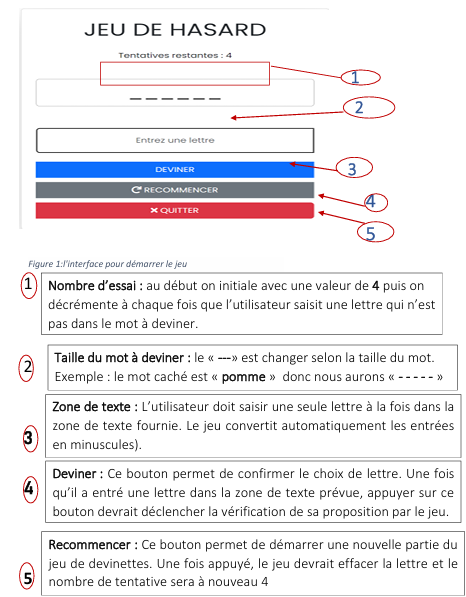

# 🎮 Application Java EE - Jeu de Devinette

Ce projet est une application web simple développée en Java EE. Le but du jeu est de deviner un mot caché en un nombre limité d'essais.

## 🔧 Technologies utilisées

- **Java EE** (Servlets)
- **JSP** pour l'interface utilisateur
- **JavaScript** pour désactiver le bouton "Deviner" après les essais
- **Bootstrap** pour un design moderne et coloré

## 🖼️ Aperçu de l'application

## 🚀 Lancement

1. Importer dans un IDE Java (comme Eclipse)
2. Déployer dans un serveur local Tomcat
3. Accéder à `http://localhost:8080/jeux-jee-APP`

## 👤 Auteur

Abdillahi Nour Hassan
